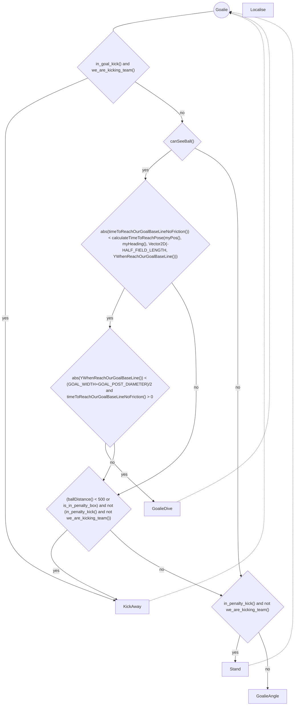

```mermaid

flowchart TD;
    1((Goalie))
    2[GoalieAngle]
    3[Localise]
    4[KickAway]
    5[GoalieDive]
    6[Stand]
    A{"in_goal_kick() and we_are_kicking_team()"}
    B{"canSeeBall()"}
    C{"abs(timeToReachOurGoalBaseLineNoFriction()) < calculateTimeToReachPose(myPos(), myHeading(), Vector2D(-HALF_FIELD_LENGTH, YWhenReachOurGoalBaseLine()))"}
    D{"abs(YWhenReachOurGoalBaseLine()) < (GOAL_WIDTH+GOAL_POST_DIAMETER)/2 and timeToReachOurGoalBaseLineNoFriction() > 0"}
    E{"(ballDistance() < 500 or is_in_penalty_box) and not (in_penalty_kick() and not we_are_kicking_team())"};
    F{"in_penalty_kick() and not we_are_kicking_team()"};
    
    1 --- A
    4 -.-> 1
    5 -.-> 1
    6 -.-> 1
    A -->|yes| 4
    A -->|no| B
    B -->|yes| C
    B -->|no| F
    C -->|yes| D
    C -->|no| E
    D -->|yes| 5
    D -->|no| E
    E -->|yes| 4
    E -->|no| F
    F -->|yes| 6
    F --->|no| 2

```