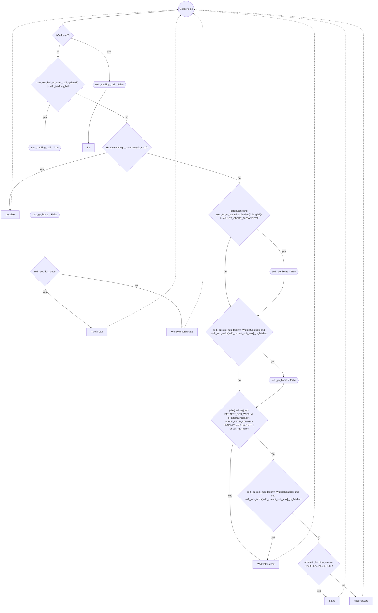

```mermaid

flowchart TD;
    1((GoalieAngle))
    2[TurnToBall]
    3[WalkWithoutTurning]
    4[Localise]
    5[WalkToGoalBox]
    6[FaceForward]
    7[Stand]
    A{"isBallLost(7)"}
    B{"can_see_ball_or_team_ball_updated() or self._tracking_ball"}
    C{"self._position_close"}
    D{"HeadAware.high_uncertainty.is_max()"}
    E{"isBallLost() and self._target_pos.minus(myPos()).length2() > self.NOT_CLOSE_DISTANCE**2"}
    F{"self._current_sub_task == 'WalkToGoalBox' and self._sub_tasks[self._current_sub_task]._is_finished"}
    G{"(abs(myPos().y) > PENALTY_BOX_WIDTH/2 or abs(myPos().x) < (HALF_FIELD_LENGTH-PENALTY_BOX_LENGTH)) or self._go_home"}
    H{"self._current_sub_task == 'WalkToGoalBox' and not self._sub_tasks[self._current_sub_task]._is_finished"}
    I{"abs(self._heading_error()) < self.HEADING_ERROR"}
    J{{self._go_home = True}}
    K{{self._go_home = False}}
    L{{self._tracking_ball = False}}
    M{{self._tracking_ball = True}}
    N{{self._go_home = False}}

    1 --- A
    A -->|yes| L
    L --> Be
    A -->|no| B
    B -->|yes| M
    M --> K
    K --> C
    C -->|yes| 2
    2 -.-> 1
    C -->|no| 3
    3 -.-> 1
    B -->|no| D
    D -->|yes| 4
    4 -.-> 1
    D -->|no| E
    E -->|yes| J
    E -->|no| F
    J --> F
    F -->|yes| N
    F -->|no| G
    N --> G
    G -->|yes| 5
    5 -.-> 1
    G -->|no| H
    H -->|yes| 5
    H -->|no| I
    I -->|yes| 7
    7 -.-> 1
    I -->|no| 6
    6 -.-> 1

```